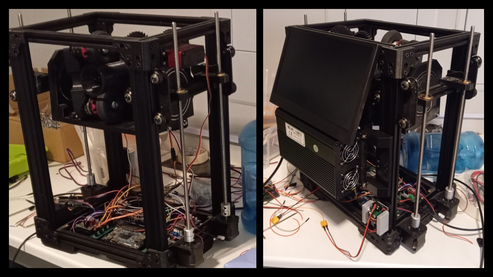
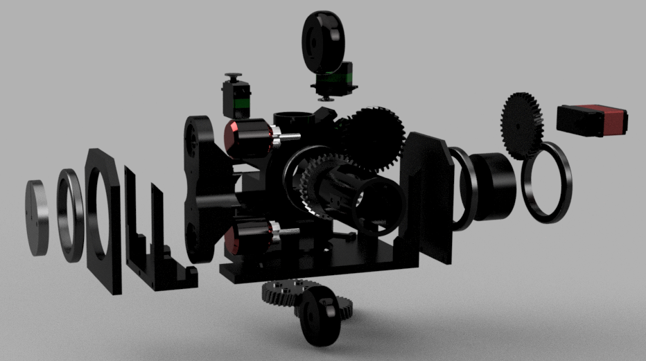
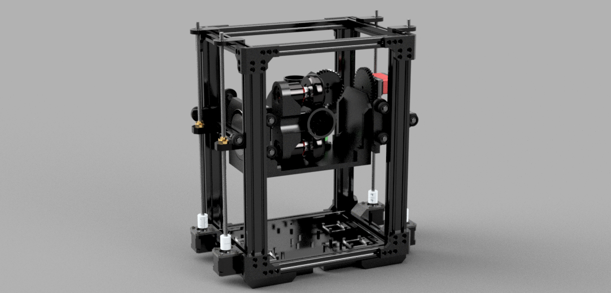
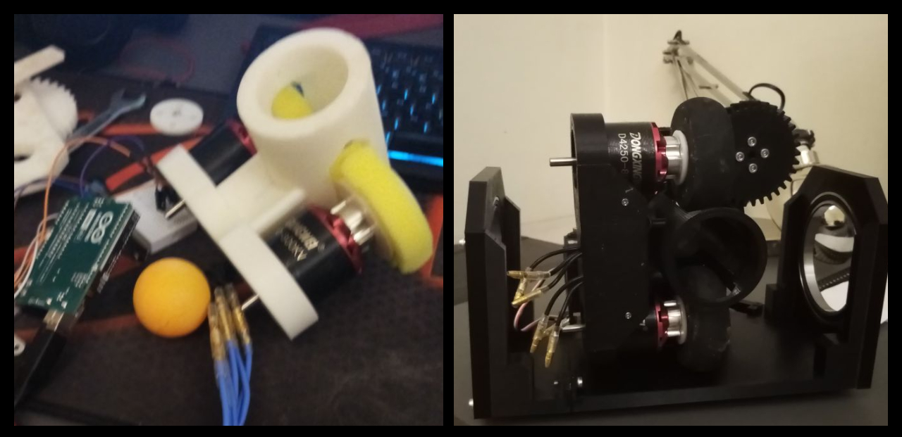
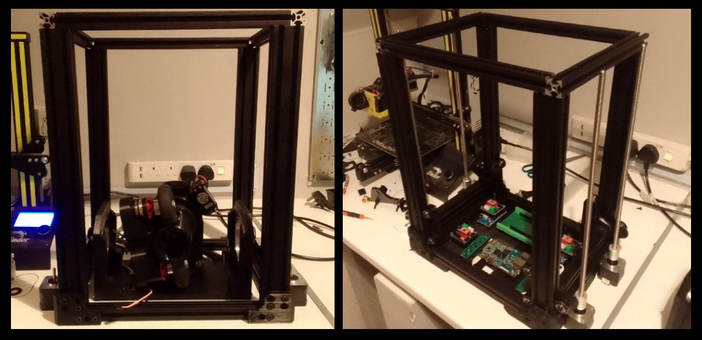
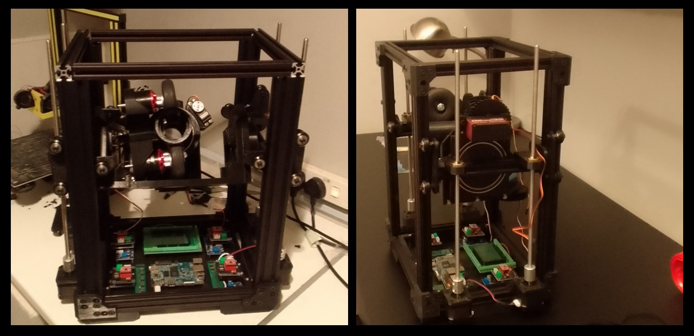
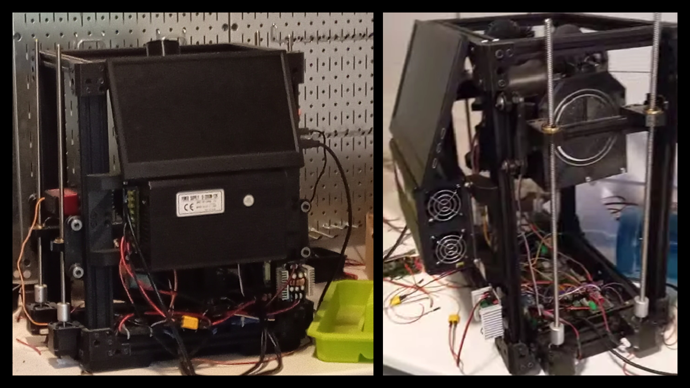

# Table-Tennis-Robot (TTR) (2023-2024)

#
A custom-built &amp; designed 4-axis Table Tennis Robot capable of replicating most shot techniques in the sport &amp; more.

# Overview

Table tennis has always been one of my favourite sports ever since I was young. But because I had limited access to training partners, I decided to put my engineering skills to work to build my very own opponent capable of playing at every level. For this to be possible, it had to have multiple degrees of freedom from a mechanical standpoint. 

# Mechanical design

For the table tennis ball to be ejected to begin with, I decided to replicate the classic design used in most sports-ball launchers: the ball is fed into two high-speed motors that then "hug" it and fling it at high speed. To make sure I got as good a hugging motion while at the same time gripping the ball without damaging it, I repurposed old RC-plane wheels. This method was favoured for many reasons, one of the most important being that adjusting either the lower or upper motor's speed (or both), as well as topspin and backspin, could be dialed in very precisely. The ball's exit speed could also be fine-tuned, especially with precision high-speed brushless motors, which from the beginning became the obvious candidate. The basic shots, such as smash, topspin, backspin, and push, were all covered by this method of ejection. For the shot to be able to hit every angle and area of the table, the shooter had to have the ability to both pitch and yaw and, at the same time, travel up and down the Z-axis. Early on, I was settled on 3 axes of freedom, but one of the most fundamental techniques in table tennis is the sidespin. 

To solve this problem, I decided to add another axis of freedom: the ability to roll/rotate the whole launch mechanism. This not only allowed sidespin, but also the amount of sidespin depending on the angle of the launching mechanism. This whole mechanical design makes it possible to create an infinite range of different shots with topspin, backspin, sidespin, angle och power all being able to be microadjusted. To make pitch, yaw, and roll motions possible, I used heavy-duty RC-plane servos as they are very easy to control and offer a great amount of torque for their speed as well. To engage the axes on bearings, I used simple helical gears attached to the servos. I used another servo to feed the balls into the launcher, and to make sure the ball didn't roll in on its own, I used a piece of laminate paper with a hole cut slightly too small. This made the ball not roll into the shooter by itself but at the same time let the ball through if pushed with enough force. The final mechanical model of the launcher is shown below.
#

#
Because the project involved very high-power spinning motors as well as many other sources of vibration, I decided to construct an aluminum frame similar to that of a 3D printer using standard 20 x 20 extrusion. For the main launcher to be able to move up and down, I decided to use the aluminum extrusions as rails, wherein linear Z-axis rods could be combined with stepper motors for controllable and extremely precise up-and-down movement, again similar to a 3D printer. Two shorter pieces of aluminum extrusion were bolted onto the main launcher with bearings to let it pitch up and down. These two pieces were also attached to the main rail, wherein the Z-axis rods were bolted through them. For stability reasons, 4 stepper motors attached to 4 Z-axis rods were responsible for the up-and-down motion of the entire launcher. A massive 3D-printed box could also be optionally bolted to the bottom frame to house different components.  
#

#

# Build

Before committing too much and attempting to build the final CAD design. I decided to try out a simple proof of concept. With two brushless motors originally intended for RC aircraft, some ESCs, and some 3D printing, I managed to rig a prototype. Because I still hadn't received my RC plane wheels to use as launchers, I 3D printed a circle and glued some sponge onto it. I then put it all in a tube with some cutouts and fed it some balls at varying speeds. I found this simple prototype to be extremely effective in practice and inspired a large amount of confidence in the final design. With everything in place, I started by constructing the launcher first.

#

#

With the launcher being done, the next obvious step was constructing the frame. The overall dimensions of the frame weren't picked out for a special reason other than the availability of aluminum extrusion in standard lengths. With the combination of 3D-printed attachment blocks, wingnuts, and bolts, the frame could be simply screwed together and still be extremely sturdy. The stepper motors are designed to be able to be directly mounted onto the bottom frame. Because I'm using wingnuts and aluminum extrusion, the steppers actually can slide side to side before being bolted, which made adjustment considerably easier later on in the build.

#

#

The main launcher could now, with bearings, be bolted onto the shorter pieces of aluminium extrusion, to which the rail gantry was also attached. I could then dismount the top frame and slide the entire launcher in. The 4 Z-axis rods ensure the entire rig is well supported and doesn't fall. The end result is a complete 4-axis robot with a robust and sturdy frame and launcher. What remained now was the wiring and power system.

#

#

# Power-system & user integration

I originally intended for LiPo to be the main power source for the entire robot. But after considering concerns such as longer usage sessions as well as the long-term condition of the LiPo constantly running servos, steppers, and high-power brushless motors, I decided on a static power supply from a wall outlet. After measuring the current draw, voltages, etc, I decided on a power supply from AliExpress encompassing all my specifications and more. Because different components needed different amounts of voltage, a sizeable number of step-down converters became necessary to supply the entire system. Similar to other projects of mine, the entire robot ran on a Raspberry Pi clone with an external microcontroller. This Raspberry Pi also had its very own screen mounted on the back of the entire robot to allow on-site programming and adjustment, which became especially necessary for this project to properly dial in shots. 

A lot of the servos also required an especially high amount of power, which made it necessary to solder my own perf boards with power lines connecting directly to the power supply via an adjustable step-down converter with dedicated signal lines. Because of the overwhelming amount of control signals, power, and wires, I used an Arduino Mega as my MCU. This meant that directly from the robot, the user is able to program different shots and test them immediately on site. 

#

#

# Results
The final construction turned out to be extremely successful. Each axis felt very responsive and robust even when the motors were operating at full speed. Programming each axis was very simple and only required a few lines of code. The consistency between the same technique (area of the table hit, speed & spin) was extremely consistent, which was very promising. Below are some videos demonstrating the functionality of the different axes and the speed at which the robot is able to switch between techniques and shots.

https://github.com/user-attachments/assets/3acb04fd-5a0b-4c92-9e44-b17a5160d175

https://github.com/user-attachments/assets/515e7c1f-c38c-46a9-aa9f-7150c75c8a55

# Future considerations

